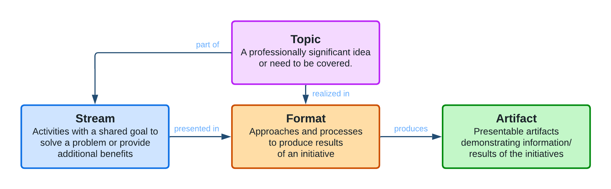

# Idea Pool Value Stream

This document describes the main **value stream** and its process that Idea Pool uses.

## Topic

Anyone can propose a **topic** or an **idea** that should be covered by the community that provides some professional benefit or advantage to the possible target audience or the participants.

Each topic has the following attributes:

| Attribute | Description | Example |
|:----------|:------------|:--------|
| Title | Concise title or description of the topic | ... |
| Description | Extended, detailed description of the topic | ... |
| <!-- attribute --> | <!-- description --> | <!-- example --> |

- [ ] Complete list of attributes of the topics

## Stream

All the topics and activities the community works on belongs to one of our **streams**.

An **stream** is the group of activities with a shared goal to solve a problem or to provide additional benefits.

Each stream has the following attributes:
* **Name** of the stream
* **Goal** to achieve
* **Benefits** delivered
* **Problem** solved
* **Owner** governing the stream

Our streams so far:

| Name | Goal | Benefits | Problem | Owner | Link |
|:-----|:-----|:---------|:--------|:------|:-----|
| **GherKing** | To develop tools to extend the functionality of Gerhkin | ... | ... | @szikszail | <https://github.com/gherking> |
| <!-- name --> | <!-- goal --> | <!-- benefit --> | <!-- problem --> | <!-- owner --> | <!-- link --> |

- [ ] Complete list of initiatives

## Format

- [ ] Add description of formats
- [ ] Add list of formats

## Artifact

- [ ] Add description of artifacts
- [ ] Add list of artifacts

