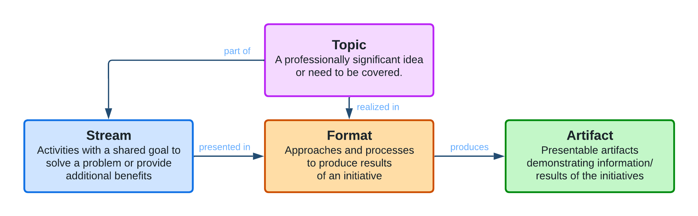
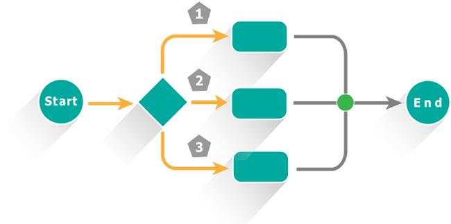

# Idea Pool Value Stream

**Table of Content:**
- [Idea Pool Value Stream](#idea-pool-value-stream)
  - [Idea](#idea)
  - [Area](#area)
  - [Stream](#stream)
    - [Education](#education)
    - [Open Source](#open-source)
    - [Authors](#authors)
    - [Cloud](#cloud)
    - [Test Automation Tool Evaluation (TA Tool Evaluation)](#test-automation-tool-evaluation-ta-tool-evaluation)
  - [Format](#format)
    - [Workshop](#workshop)
    - [Webinar](#webinar)
    - [Minutes](#minutes)
    - [Demo](#demo)
    - [Article](#article)
    - [Project](#project)
  - [Artifact](#artifact)
    - [Talk](#talk)
    - [Video](#video)
    - [Article](#article-1)
    - [Software](#software)
    - [Site](#site)
    - [Meetup](#meetup)

In the **Idea Pool Community**, we organized our processes around the following **value stream**:

## Idea

The very bases of our value stream are the ideas. Anyone can propose an **idea** (topic) that should be covered by the community.

An idea can be for example a topic to research more, an idea for a small software, or anything interesting, as long as it provides **professional benefit** or **advantage** to the possible target audience or the participants.

Each idea should have the following attributes:
* **Title** - Concise title or description of the idea.
* **Details** - An extended, detailed description of the idea, including **goals**, **benefits**, **planned tasks**, etc.
* **Area** - The professional area to which the area belongs, e.g. Test Automation.
* **Stream(s)** - To which stream the idea belongs or is intended. An idea can belong to multiple streams.
* **Format(s)** - In which format the idea should be covered, based on the formats available for the stream. An idea can be realized in multiple formats.
* **Artifact(s)** - The planned or delivered artifacts connected to the idea, based on the artifacts and the formats available/assigned to it. In the scope of an idea, multiple artifacts can be delivered.

The **title** of the idea is only mandatory when proposing a new one. However, providing the rest of the attributes (at least the **details**) of the idea is highly welcome to have a better understanding of it.

Each of these ideas is managed as an **issue** in the topics[^topics] repository.

## Area

All of the ideas belong to at least one of the professional **areas**.

Such areas can be:
* Software Development
* Testing
* Test Automation
* General
* Soft Skills

The area(s) of a given idea is marked with the `area:{name}` labels on the issue of the idea, e.g. `area:test-automation`.

## Stream

All of the ideas and activities belong to one of our **streams**. A **stream** is a group of activities with a shared goal.

Each stream is defined by
* the **Name** of the stream,
* the **Goal** the stream aims to achieve,
* the **Benefits** the stream delivers, and
* the **Owner** who mainly governs the stream.

The stream(s) of a given idea is marked with the `stream:{name}` labels on the issue of the idea, e.g. `stream:education`.

### Education

* The **goal** of the **Education stream** is to assist the development of engineers by providing help, opportunities, and materials to learn, educate, to share experiences and best practices.
* The **benefits** of participating in the Education stream include
  * ...

For more information about the stream, please turn to [Sandor Orosz][sorosz].

### Open Source

* The **goal** of the **Open Source stream** is to deepen Open Source culture within engineers and allow them to gather development experience and contribute to the Open Source Community.
* The **benefits** of participating in the Open Source stream include
  * Gathering experience with E2E software development practices, including planning, design, development, testing, release, and maintenance.
  * Contributing to the global Open Source Community.
  * Realizing software ideas with the help of experienced Open Source contributors.

For more information about the stream, please turn to [Laszlo Szikszai][szikszail].

### Authors

* The **goal** of the **Authors stream** is to...
* The **benefits** of participating in the Authors stream include
  * ...

For more information about the stream, please turn to [TBD][tbd].

### Cloud

* The **goal** of the **Cloud stream** is to...
* The **benefits** of participating in the Cloud stream include
  * ...

For more information about the stream, please turn to [Laszlo Szikszai][szikszail].

### Test Automation Tool Evaluation (TA Tool Evaluation)

* The **goal** of the **TA Tool Evaluation stream** is to...
* The **benefits** of participating in the TA Tool Evaluation stream include
  * ...

For more information about the stream, please turn to [TBD][tbd].

## Format

Any idea can be realized in one of our **formats** which are approaches and processes to produce results of a stream.

Each format is defined by
* the **Name** of the format,
* the **Process** the format uses to produce its artifacts,
* the **Artifact(s)** produced by the format,
* the **Template(s)** for the artifacts specific to this format, and
* the **Owner** who mainly maintains the format.

The format(s) of a given idea is marked with the `format:{name}` labels on the issue of the idea, e.g. `format:workshop`.

### Workshop

In the **workshop** format, a primarily offline event is organized, to cover the idea.

The main process of this format: .

As the result of a workshop, the following artifacts might be created:
 - An [article](#article) to describe the workshop and its outcome,
 - A [meetup](#meetup) and a [talk](#talk) to organize the workshop,
 - A [video](#video) recording if the workshop is held online.

For more information about the format, please turn to [TBD][tbd].

### Webinar

In the **TBD** format, TBD, to cover the idea.

The main process of this format:
.

As the result of a TBD, the following artifacts might be created:
 - [TBD](#tbd)

For more information about the format, please turn to [TBD][tbd].

### Minutes

In the **TBD** format, TBD, to cover the idea.

The main process of this format:
.

As the result of a TBD, the following artifacts might be created:
 - [TBD](#tbd)

For more information about the format, please turn to [TBD][tbd].

### Demo

In the **TBD** format, TBD, to cover the idea.

The main process of this format: 
.

As the result of a TBD, the following artifacts might be created:
 - [TBD](#tbd)

For more information about the format, please turn to [TBD][tbd].

### Article

In the **TBD** format, TBD, to cover the idea.

The main process of this format: 
.

As the result of a TBD, the following artifacts might be created:
 - [TBD](#tbd)

For more information about the format, please turn to [TBD][tbd].

### Project

In the **TBD** format, TBD, to cover the idea.

The main process of this format: 
.

As the result of a TBD, the following artifacts might be created:
 - [TBD](#tbd)

For more information about the format, please turn to [TBD][tbd].

## Artifact

The **artifacts** are achievable and presentable results produced in the scope of an idea that demonstrates information.

Each artifact (type) is defined by
* the **Name** of the artifact,
* the **Author(s)** created the artifact,
* the actual **Content** of the artifact,
* the **Location** of the artifact, and
* the **Analytics** of view/review of the artifact.

The artifact(s) of a given idea is marked with the `artifact:{name}` labels on the issue of the idea, e.g. `artifact:video`.

### Talk

An idea can be realized in a **talk** on the [WeAreCommunity][wearecommunity] page, as part of an event.

TBD

### Video

TBD

### Article

TBD

### Software

TBD

### Site

TBD

### Meetup

TBD

<!--
| Name         | Author(s)                           | Content (delivered)                                | Location                             | Analytics                |
| :----------- | :---------------------------------- | :------------------------------------------------- | :----------------------------------- | :----------------------- |
| **Talk**     | Topic owner(s)                      | WAC Talk, Presentation, Recording                  | WAC, VideoPortal, GitHub             | Views, Rating            |
| **Video**    | Topic owner(s)                      | Video                                              | WAC, VideoPortal                     | Views, Rating            |
| **Article**  | Topic owner(s), Author(s)           | WAC Article                                        | WAC, GitHub                          | Views                    |
| **Software** | Topic owner(s), Contributor(s)      | Software                                           | Artifactory (GitHub, NPM, PyPi, etc) | Download                 |
| **Site**     | Topic owner(s), Author(s)           | Webpage                                            | Hosting (GitHub Pages, AWS, Wiki)    | Views                    |
| **Meetup**   | Topic owner(s), Speakers, Moderator | WAC Event, WAC Talk, Presentation(s), Recording(s) | WAC, VideoPortal                     | Views, Rating, Attendees |
-->

<!-- LINKS -->
[szikszail]: https://github.com/szikszail
[sorosz]: https://github.com/sorosz89
[topics]: https://github.com/idea-pool/topics
[tbd]: tbd
[wearecommunity]: http://ideapool.community