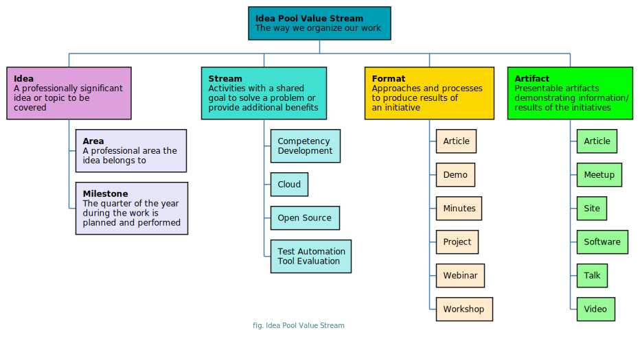
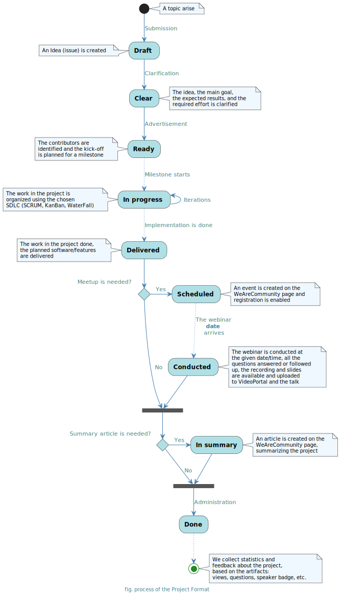
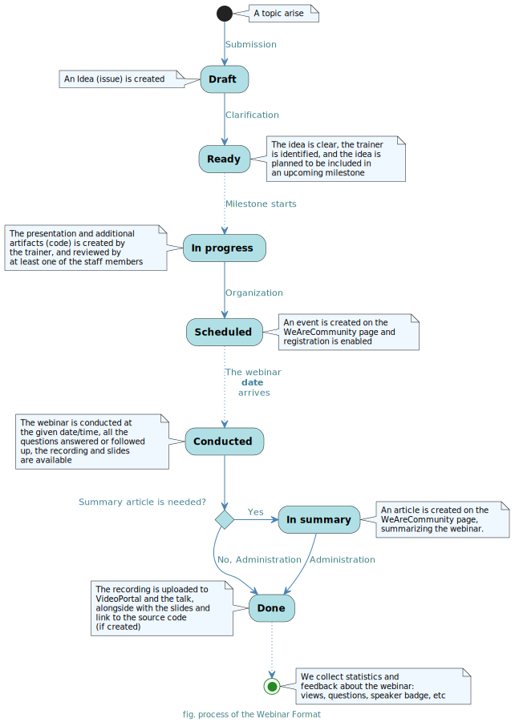

# Idea Pool Value Stream

In the **Idea Pool Community**, we organize our processes around the following **value stream**:

<!-- toc -->

- [Idea](#idea)
- [Area](#area)
- [Milestone](#milestone)
- [Stream](#stream)
  * [Competency Development](#competency-development)
  * [Cloud](#cloud)
  * [Open Source](#open-source)
  * [Test Automation Tool Evaluation (TA Tool Evaluation)](#test-automation-tool-evaluation-ta-tool-evaluation)
- [Format](#format)
  * [Article](#article)
  * [Demo](#demo)
  * [Minutes](#minutes)
  * [Project](#project)
  * [Webinar](#webinar)
  * [Workshop](#workshop)
- [Artifact](#artifact)
  * [Article](#article-1)
  * [Meetup](#meetup)
  * [Site](#site)
  * [Software](#software)
  * [Talk](#talk)
  * [Video](#video)

<!-- tocstop -->

## Idea

The very base of our value stream is the idea. Anyone can propose an **idea** (topic) that the community should cover.

An idea can be, for example, a topic to research more, an idea for a small software, or anything interesting, as long as
it provides **professional benefit** or **advantage** to the possible target audience or the participants.

Each idea is defined by:

* A concise **title** or description of the idea
* A **detailed description** of the idea, including **goals**, **benefits**, and **planned tasks**
* The professional **area** to which the area belongs, e.g., Test Automation
* The **stream(s)** the idea belongs to or is intended. An idea can belong to multiple streams.
* The **format(s)** in the idea should be covered from the formats available for the stream. An idea can be realized in
  multiple formats.
* The planned or delivered **artifact(s)** connected to the idea, based on the artifacts and the formats
  available/assigned to it. In the scope of an idea, multiple artifacts can be delivered.

The **title** of the idea is only mandatory when proposing a new one. However, providing the rest of the attributes (at
least the **details**) of the idea is highly welcome to have a better understanding of it.

Each of these ideas is managed as an **issue** in the [topics][topics] repository.

## Area

All of the ideas belong to at least one of the professional **areas**.

Such areas can be:

* General
* AI/ML
* DevOps
* Hardware
* JavaScript
* Management
* Soft Skills
* Software Development
* Test Automation
* Testing

The area(s) of a given idea is marked with the `area:{name}` labels on the issue of the idea (
e.g., `area:test-automation`).

## Milestone

When an idea is ready to work on, it is planned for a **milestone**.

A milestone is usually a given quarter of the year with its **name**, starting on the first day of the quarter, 
and ending at the last, for example, **2023 Q2** Limitless** *(2023.04.01 - 2023.06.30)*

Each milestone is planned and ideas are covered in it, still, we are flexible to include a new idea or reschedule
already planned ones.

## Stream

All of the ideas and activities belong to one of our **streams**. A **stream** is a group of activities with a shared
goal.

Each stream is defined by

* the **name** of the stream,
* the **goal(s)** the stream aims to achieve,
* the **benefit(s)** the stream delivers, and
* the **owner** who mainly governs the stream.

The stream(s) of a given idea is marked with the `stream:{name}` labels on the issue of the idea (
e.g., `stream:education`).

### Competency Development

* The **Competency Development stream** aims to assist the development of engineers by providing help, opportunities,
  and materials to learn, educate, to share experiences and best practices.
* The **benefits** of participating in the Competency Development stream include
    * ...

For more information about the stream, please turn to [Milan Horvath][milan].

### Cloud

* The **Cloud stream** aims is to aid engineers in extending their knowledge and gathering experience with cloud
  technologies, platforms, and SDLC processes adapted to it.
* The **benefits** of participating in the Cloud stream include
    * Gathering practical experience with cloud services (AWS, Azure, GCP) and connected technologies
    * Being able to adapt the standard SDLC practices to the cloud, such as development and testing

For more information about the stream, please turn to [Laszlo Szikszai][szikszail].

### Open Source

* The **Open Source stream** aims to deepen Open Source culture within engineers and allow them to gather development
  experience and contribute to the Open Source Community.
* The **benefits** of participating in the Open Source stream include
    * Gathering experience with E2E software development practices, including planning, design, development, testing,
      release, and maintenance
    * Contributing to the global Open Source Community
    * Realizing software ideas with the help of experienced Open Source contributors

For more information about the stream, please turn to [Laszlo Szikszai][szikszail].

### Test Automation Tool Evaluation (TA Tool Evaluation)

* The **TA Tool Evaluation stream** aims to give an overview for test automation engineers, both about standard test automation tools used in various technologies and the evaluation process.
* The **benefits** of participating in the TA Tool Evaluation stream include
    * Gaining experience in tool selection / practical evaluation
    * Gaining insight into how to prepare a structured and objective tool evaluation

It is recommended to read the following article: [Test Automation Tool Evaluation | Idea Pool Projects][article-ta-tool]

For more information about the stream, please turn to [Sandor Orosz][sorosz].

## Format

Any idea can be realized in one of our **formats** which are approaches and processes to produce stream results.

Each format is defined by

* the **name** of the format,
* the **process** the format uses to produce its artifacts,
* the **artifact(s)** produced by the format,
* the **template(s)** of the artifacts specific to this format, and
* the **owner** who mainly maintains the format.

The format(s) of a given idea is marked with the `format:{name}` labels on the issue of the idea (
e.g., `format:workshop`).

### Article

The **article** format provides the opportunity to the author to write a professional article about the selected topic.

The main process of this format:

As the result an article artifact will be created.

For more information about the format, please turn to [Milan Horvath][milan].

### Demo

A **demo** is a live or recorded presentation that showcases a prototype or working model of a product, service, or concept, with the aim of demonstrating its features, functionality, and potential benefits.

The main process of this format:

.

As the result of a demo, the following artifacts might be created:

- An [article](#article) to summarize the topic of the demo,
- A [software](#software) (repository) containing the source code used during the demo,
- A [meetup](#meetup) and a [talk](#talk) to organize the demo,
- A [video](#video) recording of the demo.

For more information about the format, please turn to [Gabor Marton][gabor].

### Minutes

In the **Minutes** format, a short, to-the-point video is created to cover the idea.

The Idea Pool Minutes is rather an offline creative work than a classical tech talk or meetup. The expected output of Minutes is a 1-5 minutes long video animation including various techniques and tricks to highlight your idea.
The Minutes is an answer to a question that can be answered within a short, tutorial-like video by spectacular and talkative visual elements. The focus is on providing a summary of a topic and highlights the key points in an easily digestible format.

The main process of this format:

.

As the result of a Minutes, the following artifacts might be created:

- A [video](#video) composed/recorded about the idea to be shared

For more information about the format, please turn to [Sandor Orosz][sorosz].

### Project

In the **project** format, a small project is organized around the idea to cover it and achieve its goal.

Usually, those ideas are targets to be delivered with a project, that is more complex, time-consuming or holds the
potential to involve more collaboration. Typically, software ideas are covered with projects, for
example, [GherKing][gherking].

The main process of this format:

As the result of a project, the following artifacts might be created:

- An [article](#article) to summarize the work done and the result of the project,
- A [meetup](#meetup) and a [talk](#talk) to demonstrate the project,
- A [video](#video) recording of the meetup,
- A [site](#site) (documentation) or a [software](#software) (package, PoC) as the main delivered artifact of the
  project.

For more information about the format, please turn to [Laszlo Szikszai][szikszail].

### Webinar

In the **webinar** format, an online event is organized, to cover the idea, to explain the topic and reflect on
questions related to it.

The main process of this format:

As the result of a webinar, the following artifacts might be created:

- An [article](#article) to summarize the topic of the webinar,
- A [meetup](#meetup) and a [talk](#talk) to organize the webinar,
- A [video](#video) recording the webinar,
- A [software](#software) (repository) containing the source code used during the webinar (if there were any).

For more information about the format, please turn to [Laszlo Szikszai][szikszail].

### Workshop

In the **workshop** format, a primarily offline event is organized, to cover the idea.

The main process of this format:

As the result of a workshop, the following artifacts might be created:

- An [article](#article) to describe the workshop and its outcome,
- A [meetup](#meetup) and a [talk](#talk) to organize the workshop,
- A [video](#video) recording if the workshop is held online.

For more information about the format, please turn to [Sandor Orosz][sorosz].

## Artifact

The **artifacts** are achievable and presentable results produced in the scope of an idea that demonstrates information.

Each artifact (type) is defined by

* the **name** of the artifact,
* the **author(s)** created the artifact,
* the actual **content** of the artifact,
* the **location** of the artifact, and
* the **analytics** of view/review of the artifact.

The artifact(s) of a given idea is marked with the `artifact:{name}` labels on the issue of the idea (
e.g., `artifact:video`).

### Article

An article directly maps to an **article** on the [WeAreCommunity][wearecommunity] page (
e.g., [Story telling - Team SSG - Hackathon experience][article]).

### Meetup

A meetup directly maps to an **event** on the [WeAreCommunity][wearecommunity] page (
e.g., [AI based image generation with OpenAI's DALL-E API][event]).

Meetups can have different formats, including Tech-Talk, Demo, and Workshop.

### Site

A site is either a **static web page** or a dynamic web application created and hosted on **GitHub Pages** or the **Idea
Pool Domain** (e.g., [AWS Testing][awstesting]).

A site is also **software**, meaning similar processes can apply to it as for the software artifact (e.g., creating a
repository, or setting up a project).

### Software

The software can be either a **source code** (e.g., [evaluation-request-interception][sourcecode]) or the **delivered
software** (e.g., aws-cdk-assert [Source][packagesource]/[NPM][packagenpm]) as well as any artifactory/repository (e.g.,
NPM, PyPi).

For each software, we usually create a separate repository ([aws-cdk-assert][packagesource]) or
project/organization ([GherKing][gherking]), depending on its size.

### Talk

A talk directly maps to a **talk** on the [WeAreCommunity][wearecommunity] page as part of an event (
e.g., [AI based image generation with OpenAI's DALL-E API][talk]).

### Video

A video is an audio-visual artifact that can be either a **recording** of a talk (
e.g., [AI-based image generation with OpenAI's DALL-E API][recoring]) or a **manually recorded/edited** video/movie (
e.g., [NPM Semantic Versioning][minutes]).

All our videos are hosted on [VideoPortal][videoportal] and synchronized to [WeAreCommunity][wearecommunity].

<!-- LINKS -->

[szikszail]: https://github.com/szikszail

[sorosz]: https://github.com/sorosz89

[milan]: https://github.com/horvathmilan

[gabor]: https://github.com/mgabor18

[topics]: https://github.com/idea-pool/topics

[wearecommunity]: http://ideapool.community

[article]: https://wearecommunity.io/communities/idea-pool/articles/1662

[videoportal]: https://videoportal.epam.com/channel/95lajl4RBE/videos

[minutes]: https://videoportal.epam.com/video/KR7xxBJ4

[recoring]: https://videoportal.epam.com/video/kaEPkG7e

[talk]: https://wearecommunity.io/events/ai-based-image-generation-with-openai-s-dall-e-api/talks/49357

[sourcecode]: https://github.com/Idea-Pool/evaluation-request-interception

[packagesource]: https://github.com/Idea-Pool/aws-cdk-assert

[packagenpm]: https://www.npmjs.com/package/aws-cdk-assert

[gherking]: https://github.com/gherking

[awstesting]: https://aws-testing.ideapool.community/

[event]: https://wearecommunity.io/events/ai-based-image-generation-with-openai-s-dall-e-api

[article-ta-tool]: https://wearecommunity.io/communities/idea-pool/articles/296
